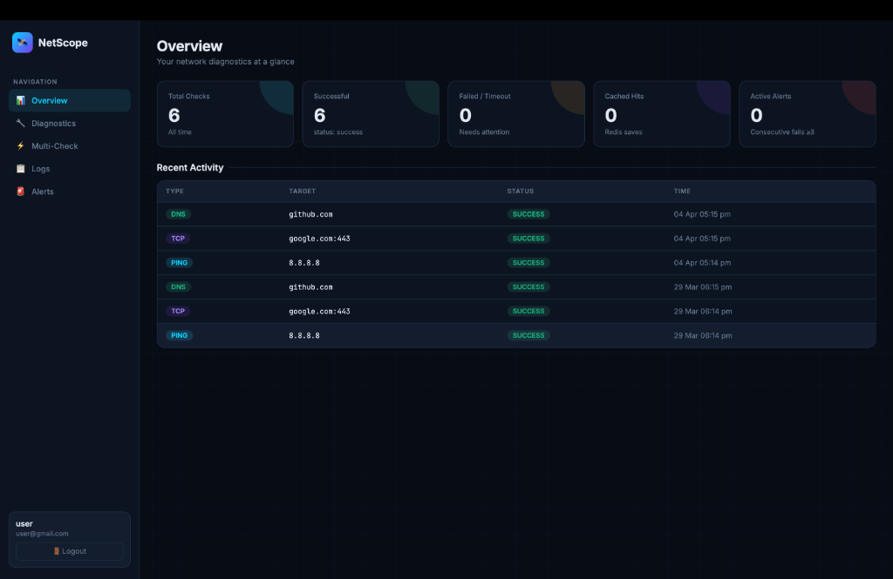
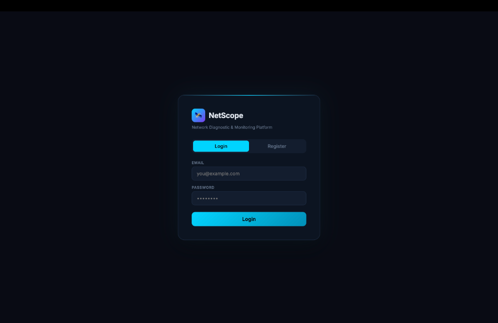
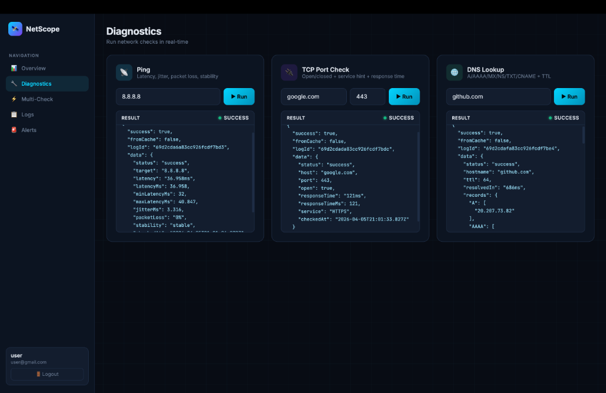
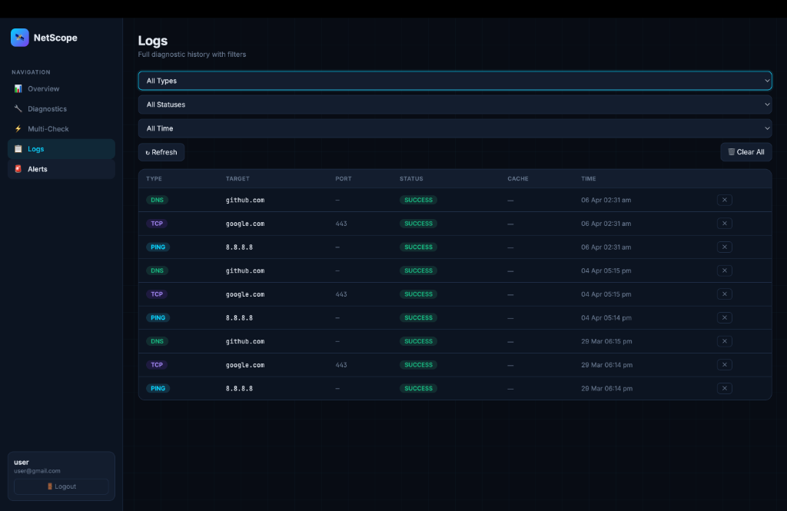
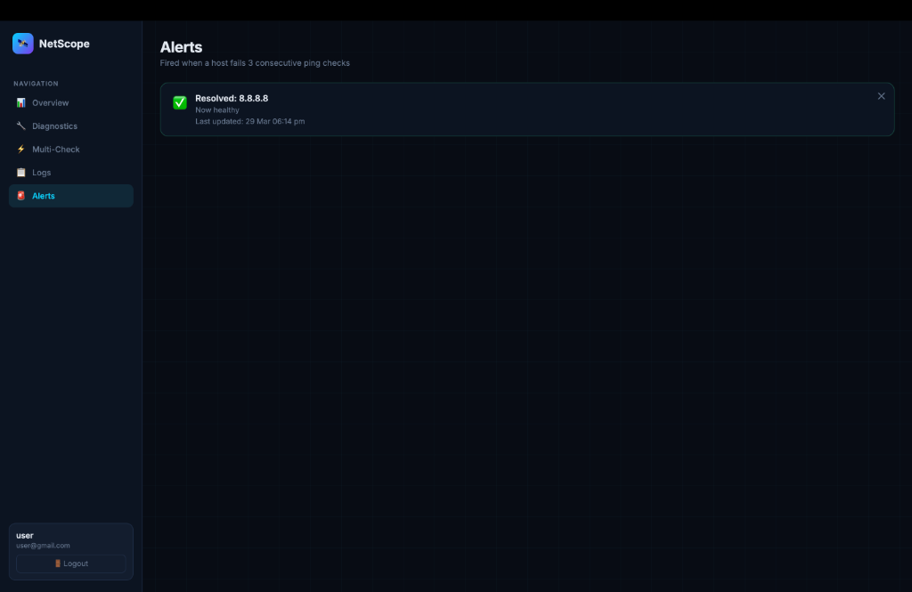

# 🛰️ NetScope — Network Diagnostic & Monitoring Platform

A full-stack network diagnostics API with a real-time browser dashboard. Built with **Node.js / Express**, **MongoDB**, **Redis**, and **Docker**.

---

## 📸 Screenshots

### 🖼️ Dashboard Overview


### 🔐 Login Page


### 📡 Real-time Diagnostics


### 📋 Diagnostic Logs


### 🚨 Active Alerts


---

## ✨ Features

| Category | Features |
|---|---|
| 🔐 **Auth** | JWT register / login / me — bcrypt(12), rate-limited |
| 📡 **Ping** | Latency, jitter, packet loss, stability score |
| 🔌 **TCP** | Port open/closed + response time + service auto-detection (30+ ports) |
| 🌐 **DNS** | A / AAAA / MX / NS / TXT / CNAME records + TTL + resolve time |
| ⚡ **Multi-Check** | Parallel checks on up to 10 hosts in one request |
| 🚨 **Alerts** | Auto-fires when a host fails 3+ consecutive pings |
| 💾 **Logs** | History with filters: type / status / date range (24h / 7d / 30d) |
| ⚡ **Redis Cache** | Per-type TTL: Ping 30s, TCP 60s, DNS 120s |
| 🖥️ **Dashboard** | Single-page browser UI — no extra setup needed |
| 🐳 **Docker** | Full stack (app + MongoDB + Redis) via docker-compose |

---

## 📁 Project Structure

```
netscope/
├──assets                   # UI representaion of the project
│   └── alerts.png          
│   └── dashboard.png
│   └── diagnostics.png
│   └── login.png
│   └── logs.png
├── public/
│   └── index.html          # Browser dashboard (served by Express)
├── src/
│   ├── config/
│   │   ├── db.js           # MongoDB connection
│   │   └── redis.js        # Redis connection + graceful fallback
│   ├── middleware/
│   │   └── auth.js         # JWT Bearer token verification
│   ├── models/
│   │   ├── User.js         # User schema (bcrypt pre-save hook)
│   │   ├── NetworkLog.js   # All diagnostic results
│   │   └── Alert.js        # Consecutive-failure alert tracker
│   ├── routes/
│   │   ├── auth.js         # /api/auth
│   │   ├── diagnostics.js  # /api/diagnostics
│   │   └── logs.js         # /api/logs
│   ├── utils/
│   │   ├── ping.js         # execFile-based ping (command-injection safe)
│   │   ├── tcp.js          # net.Socket TCP prober
│   │   └── dns.js          # Node dns.promises full resolver
│   └── app.js              # Express entry point
├── .env.example
├── Dockerfile
└── docker-compose.yml
```

---

## ⚙️ Quick Start

### Option A — Docker (Recommended)

```bash
cp .env.example .env       # review and edit if needed
npm run docker:up          # builds & starts app + mongo + redis
```

Visit: **http://localhost:5001**

### Option B — Local Dev

Prerequisites: Node.js v18+, MongoDB running locally, Redis running locally.

```bash
cp .env.example .env
# Edit .env: set MONGO_URI=mongodb://localhost:27017/netscope
#            set REDIS_URL=redis://localhost:6379
npm install
npm run dev
```

> If Redis is not running locally the app still works — caching is disabled gracefully.

---

## 📡 API Reference

**Base URL:** `http://localhost:5001`

### Auth  *(public — rate limited: 10 req / 15 min)*

| Method | Endpoint | Body | Response |
|---|---|---|---|
| POST | `/api/auth/register` | `{username, email, password}` | `{token, user}` |
| POST | `/api/auth/login` | `{email, password}` | `{token, user}` |
| GET | `/api/auth/me` | — | `{user}` |

### Diagnostics *(🔒 JWT required — 100 req / 15 min)*

| Method | Endpoint | Body | Description |
|---|---|---|---|
| POST | `/api/diagnostics/ping` | `{target}` | Ping with latency, jitter, packet loss, stability |
| POST | `/api/diagnostics/tcp` | `{host, port}` | TCP check with response time + service name |
| POST | `/api/diagnostics/dns` | `{hostname}` | Full DNS (A/AAAA/MX/NS/TXT/CNAME + TTL) |
| POST | `/api/diagnostics/multi` | `{targets[], type, port?}` | Parallel multi-host check (max 10) |
| GET | `/api/diagnostics/alerts` | — | List all alert records |
| DELETE | `/api/diagnostics/alerts/:id` | — | Dismiss an alert |

### Logs *(🔒 JWT required)*

| Method | Endpoint | Query | Description |
|---|---|---|---|
| GET | `/api/logs` | `?type=ping&status=failed&since=24h&page=1` | Filtered log list |
| GET | `/api/logs/:id` | — | Single log |
| DELETE | `/api/logs/:id` | — | Delete log |
| DELETE | `/api/logs` | — | Clear all logs |

**Log filter options:**
- `type`: `ping` | `tcp` | `dns`
- `status`: `success` | `failed` | `failure` | `timeout`
- `since`: `24h` | `7d` | `30d` | ISO date string

### Health
```
GET /health  →  200 { success, service, version, timestamp }
```

 

## 🐳 Docker Commands

```bash
npm run docker:up          # Build + start all containers (detached)
npm run docker:down        # Stop and remove containers
docker compose logs -f app # Stream API logs
docker ps                  # Check running containers
docker compose down -v     # ⚠️ Also wipes volumes (data)
```

Docker Compose port mapping:
- API → `localhost:5001`
- MongoDB → `localhost:27017`
- Redis → `localhost:6380` *(host port differs to avoid collision with local Redis)*

---

## 🛡️ Security

| Measure | Detail |
|---|---|
| Command injection prevention | `execFile()` + allowlist regex on all ping targets |
| Rate limiting | 10 req/15min on auth, 100 req/15min globally |
| Body size cap | `express.json({ limit: '10kb' })` |
| Password hashing | bcrypt with 12 rounds |
| JWT verification | `jsonwebtoken.verify()` on every protected route |
| Input validation | Port range 1–65535, hostname length ≤253 |

See full audit → [security_audit.md](./brain/security_audit.md)

---

## 🏗️ Tech Stack

| Layer | Technology |
|---|---|
| Runtime | Node.js v18 (Alpine in Docker) |
| Framework | Express.js 4 |
| Auth | JWT + bcryptjs |
| Database | MongoDB 6 + Mongoose 8 |
| Cache | Redis 7 + ioredis 5 |
| Container | Docker + Docker Compose |
| Rate Limit | express-rate-limit |
| Frontend | Vanilla HTML / CSS / JS |
# Netscope
